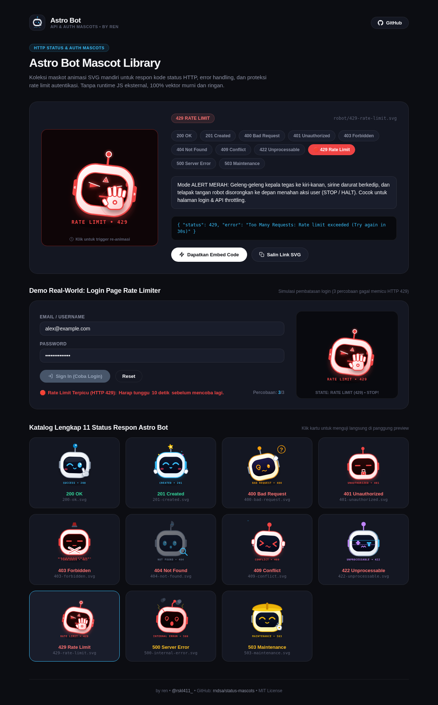

# Astro Bot — Status Mascots

[](https://opensource.org/licenses/MIT)
[]()
[-38bdf8.svg)]()
[]()
[-ff70a6.svg)](https://instagram.com/rskl411_)

> Maskot animasi vektor SVG mandiri untuk respon kode status HTTP, error handling, dan proteksi autentikasi/rate-limiting API. Ditenagai murni oleh CSS `@keyframes` internal tanpa dependensi runtime eksternal.

---

## ⚡ Kelebihan & Fitur Utama

* **Koleksi 11 Kode Respon HTTP Lengkap**:
  Astro Bot memiliki 11 ekspresi status spesifik untuk seluruh siklus hidup request web:
  * `200 OK`: Floating inersia ceria, kedipan winking cyan, dan gestur jempol tangan robot melayang (thumbs up).
  * `201 Created`: Lompatan gembira squash & stretch, bintang emas menyala di antena, dan kedua tangan bersorak.
  * `400 Bad Request`: Kepala miring bingung 13 derajat, tangan menggaruk helm, mata spiral (@), dan tanda tanya melayang.
  * `401 Unauthorized`: Geleng kepala menolak dengan gembok siber merah dan tatapan radar squinting tegas.
  * `403 Forbidden`: Gestur tangan bersilang perisai (🙅) membentuk palang segel merah darurat dengan sirine polisi aktif.
  * `404 Not Found`: Piringan radar berputar 360°, mata celingukan kiri-kanan mencari data dengan kaca pembesar digital.
  * `409 Conflict`: Kedua tangan memegangi kepala panik, gemetar shiver kencang, mata silang (> <), dan keringat anime mengucur.
  * `422 Unprocessable`: Efek chromatic aberration RGB glitch bergeser (cyan & magenta offset) dengan scanline data error.
  * `429 Rate Limit`: Mode ALERT MERAH dengan geleng kepala tegas kiri-kanan, sirine darurat berkedip, dan telapak tangan robot disorongkan ke depan menahan aksi user (STOP / HALT). Dirancang khusus untuk login throttled & brute-force lockouts.
  * `500 Server Error`: Helm retak berasap hitam tebal, percikan petir korsleting listrik, antena bengkok, dan mata pusing spiral (@_@).
  * `503 Maintenance`: Memakai helm proyek kuning keselamatan dan tangan robot aktif memutar kunci inggris memperbaiki sistem.
* **Animasi Fisika CSS Murni (Zero Dependency)**:
  * Murni embedded CSS di dalam file SVG tanpa membutuhkan library eksternal (Lottie, GIF, JS, atau canvas runtime).
  * Terbaca natively oleh tag `` browser modern.
* **Ukuran Sangat Ringan (<8 KB)**:
  * Vektor scalable tak terbatas, 100% valid XML, bebas ampersand unescaped, dan siap pakai di production edge.
* **Desain Anti-Slop (Cue by Manus Aesthetic)**:
  * Antarmuka showcase menggunakan dark slate pekat (`#0c0d12`), rounded cards 22px (`#141722`), border 1px subtle, dan typography clean.

---

## ⚠️ Kekurangan & Batasan Sistem

* **Viewer Gambar Statis Offline**:
  * Aplikasi desktop pembuka gambar lawas atau engine PDF generator statis mungkin hanya merender frame awal SVG tanpa mengeksekusi loop animasi CSS `@keyframes`.
* **Fokus Khusus Satu Karakter**:
  * Seluruh ekosistem status terfokus murni pada arketipe karakter Astro Bot untuk menjamin kualitas visual, gestur tangan, dan konsistensi storytelling di seluruh varian status.

---

## 🚀 Cara Pakai & Panduan Integrasi

### 1. Direct Embed via Tag HTML
Format direct URL: https://raw.githubusercontent.com/rndsa/status-mascots/main/mascots/robot/<status>.svg

```html
<!-- Astro Bot 200 OK (Thumbs Up) -->


<!-- Astro Bot 429 Rate Limit (Stop Hand & Red Alert) -->


<!-- Astro Bot 500 Server Error (Cracked & Sparks) -->

```

### 2. Komponen Dinamis React / Next.js

```jsx
const ASTRO_STATUS_MAP = {
  200: "200-ok.svg",
  201: "201-created.svg",
  400: "400-bad-request.svg",
  401: "401-unauthorized.svg",
  403: "403-forbidden.svg",
  404: "404-not-found.svg",
  409: "409-conflict.svg",
  422: "422-unprocessable.svg",
  429: "429-rate-limit.svg",
  500: "500-internal-error.svg",
  503: "503-maintenance.svg",
};

export function AstroMascot({ code = 200, size = 160 }) {
  const filename = ASTRO_STATUS_MAP[code] || "200-ok.svg";
  const src = `https://raw.githubusercontent.com/rndsa/status-mascots/main/mascots/robot/${filename}`;

  return (
    
  );
}
```

### 3. Implementasi Halaman Login / Auth Rate Limiting

```jsx
// Contoh penggunaan di proteksi brute-force login
if (failedAttempts >= 3) {
  return (
    <div className="rate-limit-card">
      <AstroMascot code={429} size={180} />
      <h3>Rate Limit Terpicu (HTTP 429)</h3>
      <p>Terlalu banyak percobaan login gagal. Silakan tunggu 30 detik.</p>
    </div>
  );
}
```

---

## 📊 Matriks 11 Status Respon Astro Bot

| Status Code | Nama Status | File SVG | Fitur & Karakter Animasi |
| :--- | :--- | :--- | :--- |
| **`200 OK`** | Success | `200-ok.svg` | Winking cyan, jempol tangan robot melayang (thumbs up) |
| **`201 Created`** | Created | `201-created.svg` | Melompat squash & stretch, bintang emas antena, tangan bersorak |
| **`400 Bad Request`** | Bad Request | `400-bad-request.svg` | Kepala miring 13°, tangan menggaruk helm, spiral eye, bubble `?` |
| **`401 Unauthorized`** | Unauthorized | `401-unauthorized.svg` | Geleng kepala menolak, gembok siber merah, radar stern glare |
| **`403 Forbidden`** | Forbidden | `403-forbidden.svg` | Tangan bersilang perisai (🙅), sirine polisi, garis segel merah |
| **`404 Not Found`** | Not Found | `404-not-found.svg` | Piringan radar 360°, mata celingukan, kaca pembesar digital |
| **`409 Conflict`** | Conflict | `409-conflict.svg` | Tangan memegangi kepala panik, shiver kencang, mata `> <`, air mata anime |
| **`422 Unprocessable`** | Unprocessable | `422-unprocessable.svg` | RGB chromatic glitch cyan/magenta offset, scanline data error |
| **`429 Rate Limit`** | Rate Limit | `429-rate-limit.svg` | **Red Alert**: Geleng-geleng kepala, sirine darurat, telapak tangan STOP |
| **`500 Server Error`** | Internal Error | `500-internal-error.svg` | Helm retak, kepulan asap tebal, kabel putus percikan petir, mata `@_@` |
| **`503 Maintenance`** | Maintenance | `503-maintenance.svg` | Helm proyek keselamatan kuning, tangan robot memutar kunci inggris |

---

## 🖼️ Tampilan Antarmuka Showcase



---

## 📄 Lisensi & Kontributor

* **Lisensi**: MIT License
* **Kredit Desain & Kode**: by ren (Instagram: https://instagram.com/rskl411_)
* **Repositori GitHub**: https://github.com/rndsa/status-mascots
