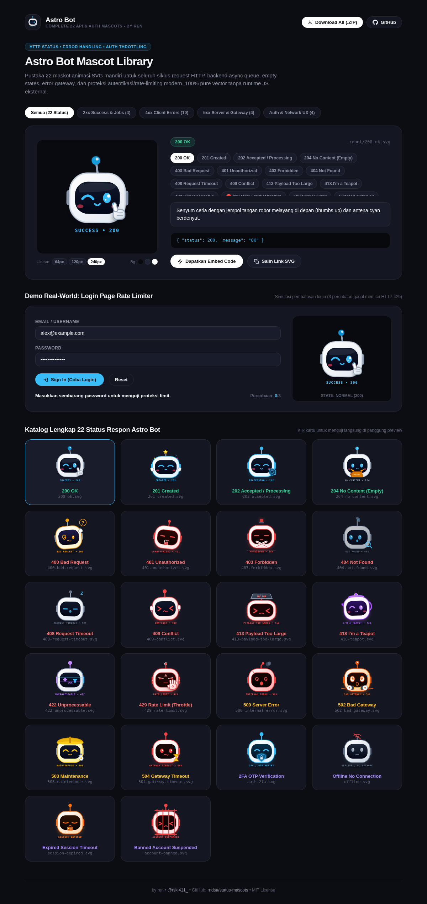

# Astro Bot — Status Mascots

[](https://opensource.org/licenses/MIT)
[]()
[-38bdf8.svg)]()
[]()
[-ff70a6.svg)](https://instagram.com/rskl411_)

> Pustaka 22 maskot animasi vektor SVG mandiri untuk seluruh siklus request HTTP, backend async queue, empty states, gateway errors, dan proteksi autentikasi/rate-limiting modern. Ditenagai murni oleh CSS `@keyframes` internal tanpa dependensi runtime eksternal.

---

## ⚡ Kelebihan & Fitur Utama

* **22 Koleksi Status HTTP & UX Modern Lengkap**:
  Mencakup seluruh siklus hidup request aplikasi web modern:
  * **2xx (Success & Jobs)**: `200 OK` (Thumbs up), `201 Created` (Bintang emas & sorak), `202 Accepted` (Roda gigi antrean async), `204 No Content` (Kardus paket kosong melompong).
  * **4xx (Client Errors & Security)**: `400 Bad Request` (Garuk helm bingung), `401 Unauthorized` (Gembok siber & geleng menolak), `403 Forbidden` (Perisai tangan bersilang 🙅), `404 Not Found` (Piringan radar & kaca pembesar), `408 Request Timeout` (Terkantuk lemas z Z Z), `409 Conflict` (Pegang kepala panik & keringat deras), `413 Payload Too Large` (Gepeng ketiban beban 100MB), `418 I'm a Teapot` (Corong teko uap siber), `422 Unprocessable` (RGB chromatic glitch scanline), `429 Rate Limit` (Alert merah, geleng-geleng kepala, dan tangan menyetop STOP / HALT).
  * **5xx (Server & Gateway)**: `500 Server Error` (Helm retak, asap hitam, percikan korsleting), `502 Bad Gateway` (Memegang kabel upstream putus dengan loncatan petir tegangan tinggi), `503 Maintenance` (Helm proyek kuning & kunci inggris), `504 Gateway Timeout` (Memandang cemas jam pasir digital berputar).
  * **Auth & Network UX States**: `2FA / OTP Verification` (Tameng pelindung holografik gembok 6 digit), `Offline / No Internet` (Sinyal WiFi tersilang merah), `Session Expired` (Kartu akses JWT pudar dissolving), `Account Suspended / Banned` (Terkurung jeruji laser merah).
* **Animasi Fisika CSS Murni (Zero Dependency)**:
  * Murni embedded CSS di dalam file SVG tanpa butuh library eksternal (Lottie, GIF, JS, atau canvas runtime).
  * Otomatis ter-render mulus di tag `` browser modern.
* **Ukuran Sangat Ringan (<8 KB per File)**:
  * Vektor scalable tak terbatas, 100% valid XML, bebas ampersand unescaped, dan siap pakai di production edge.
* **Desain Anti-Slop (Cue by Manus Aesthetic)**:
  * Dark slate pekat (`#0c0d12`), rounded cards 22px (`#141722`), border 1px subtle, dan typography clean.
* **Bundle Sekali Unduh (.ZIP)**:
  * Seluruh 22 file SVG siap diunduh dalam satu arsip ZIP praktis untuk integrasi lokal instan.

---

## ⚠️ Kekurangan & Batasan Sistem

* **Viewer Gambar Statis Offline**:
  * Aplikasi desktop pembuka gambar lawas atau generator PDF statis hanya merender frame awal tanpa loop animasi CSS `@keyframes`.
* **Fokus Eksklusif Satu Karakter**:
  * Seluruh ekosistem status terfokus murni pada karakter Astro Bot untuk menjamin kedalaman ekspresi, gestur tangan, dan konsistensi visual di seluruh status code.

---

## 🚀 Cara Pakai & Panduan Integrasi

### 1. Direct Embed via Tag HTML
Format direct URL: https://raw.githubusercontent.com/rndsa/status-mascots/main/mascots/robot/<status>.svg

```html
<!-- Astro Bot 200 OK (Thumbs Up) -->


<!-- Astro Bot 429 Rate Limit (Stop Hand & Red Alert) -->


<!-- Astro Bot 502 Bad Gateway (Severed Sparks) -->


<!-- Astro Bot 2FA Verification Shield -->

```

### 2. Komponen Dinamis React / Next.js

```jsx
const ASTRO_STATUS_MAP = {
  // 2xx
  200: "200-ok.svg",
  201: "201-created.svg",
  202: "202-accepted.svg",
  204: "204-no-content.svg",
  // 4xx
  400: "400-bad-request.svg",
  401: "401-unauthorized.svg",
  403: "403-forbidden.svg",
  404: "404-not-found.svg",
  408: "408-request-timeout.svg",
  409: "409-conflict.svg",
  413: "413-payload-too-large.svg",
  418: "418-teapot.svg",
  422: "422-unprocessable.svg",
  429: "429-rate-limit.svg",
  // 5xx
  500: "500-internal-error.svg",
  502: "502-bad-gateway.svg",
  503: "503-maintenance.svg",
  504: "504-gateway-timeout.svg",
  // Auth & UX
  "2fa": "auth-2fa.svg",
  "offline": "offline.svg",
  "expired": "session-expired.svg",
  "banned": "account-banned.svg",
};

export function AstroMascot({ code = 200, size = 160 }) {
  const filename = ASTRO_STATUS_MAP[code] || "200-ok.svg";
  const src = `https://raw.githubusercontent.com/rndsa/status-mascots/main/mascots/robot/${filename}`;

  return (
    
  );
}
```

### 3. Implementasi Halaman Login / Auth Rate Limiting

```jsx
// Contoh penggunaan di proteksi brute-force login
if (failedAttempts >= 3) {
  return (
    <div className="rate-limit-card">
      <AstroMascot code={429} size={180} />
      <h3>Rate Limit Terpicu (HTTP 429)</h3>
      <p>Terlalu banyak percobaan login gagal. Silakan tunggu 30 detik.</p>
    </div>
  );
}
```

---

## 📊 Matriks 22 Status Respon Astro Bot

| Kategori | Status Code | Nama Status | File SVG | Fitur & Karakter Animasi |
| :--- | :--- | :--- | :--- | :--- |
| **2xx** | `200 OK` | Success | `200-ok.svg` | Winking cyan, jempol tangan robot melayang (thumbs up) |
| **2xx** | `201 Created` | Created | `201-created.svg` | Melompat squash & stretch, bintang emas antena, tangan bersorak |
| **2xx** | `202 Accepted` | Processing | `202-accepted.svg` | Tenang menunggu antrean background job dengan roda gigi holografik |
| **2xx** | `204 No Content` | Empty State | `204-no-content.svg` | Membuka kardus paket kosong melompong dengan senyum polos |
| **4xx** | `400 Bad Request` | Bad Request | `400-bad-request.svg` | Kepala miring 13°, tangan menggaruk helm, spiral eye, bubble `?` |
| **4xx** | `401 Unauthorized` | Unauthorized | `401-unauthorized.svg` | Geleng kepala menolak, gembok siber merah, radar stern glare |
| **4xx** | `403 Forbidden` | Forbidden | `403-forbidden.svg` | Tangan bersilang perisai (🙅), sirine polisi, garis segel merah |
| **4xx** | `404 Not Found` | Not Found | `404-not-found.svg` | Piringan radar 360°, mata celingukan, kaca pembesar digital |
| **4xx** | `408 Request Timeout` | Timeout | `408-request-timeout.svg` | Terkantuk-kantuk lemas dengan gelembung tidur z Z Z melayang |
| **4xx** | `409 Conflict` | Conflict | `409-conflict.svg` | Tangan memegangi kepala panik, shiver kencang, mata `> <`, air mata anime |
| **4xx** | `413 Payload Too Large`| Too Large | `413-payload-too-large.svg` | Helm gepeng ketiban beban blok arsip 100MB raksasa |
| **4xx** | `418 I'm a Teapot` | Teapot | `418-teapot.svg` | Memakai tutup teko, gagang cangkir samping, corong menuang teh siber |
| **4xx** | `422 Unprocessable` | Unprocessable | `422-unprocessable.svg` | RGB chromatic glitch cyan/magenta offset, scanline data error |
| **4xx** | `429 Rate Limit` | Rate Limit | `429-rate-limit.svg` | **Red Alert**: Geleng kepala, sirine darurat, telapak tangan STOP |
| **5xx** | `500 Server Error` | Server Error | `500-internal-error.svg` | Helm retak, asap hitam, kabel putus percikan petir, mata `@_@` |
| **5xx** | `502 Bad Gateway` | Bad Gateway | `502-bad-gateway.svg` | Memegang kabel upstream putus dengan loncatan petir tegangan tinggi |
| **5xx** | `503 Maintenance` | Maintenance | `503-maintenance.svg` | Helm proyek keselamatan kuning, tangan robot memutar kunci inggris |
| **5xx** | `504 Gateway Timeout` | Timeout | `504-gateway-timeout.svg` | Memandang cemas jam pasir digital berputar 180° |
| **Auth** | `2FA / OTP` | Verification | `auth-2fa.svg` | Tameng pelindung holografik siber dengan gembok kode 6 digit |
| **Network** | `Offline` | No Internet | `offline.svg` | Sinyal WiFi tersilang merah di atas antena, mencari sinyal |
| **Auth** | `Session Expired` | Expired | `session-expired.svg` | Kartu akses JWT pudar dissolving dengan senyum sendu |
| **Auth** | `Account Banned` | Suspended | `account-banned.svg` | Terkurung di balik jeruji laser merah berdenyut, tatapan murung |

---

## 🖼️ Tampilan Antarmuka Showcase



---

## 📄 Lisensi & Kontributor

* **Lisensi**: MIT License
* **Kredit Desain & Kode**: by ren (Instagram: https://instagram.com/rskl411_)
* **Repositori GitHub**: https://github.com/rndsa/status-mascots
